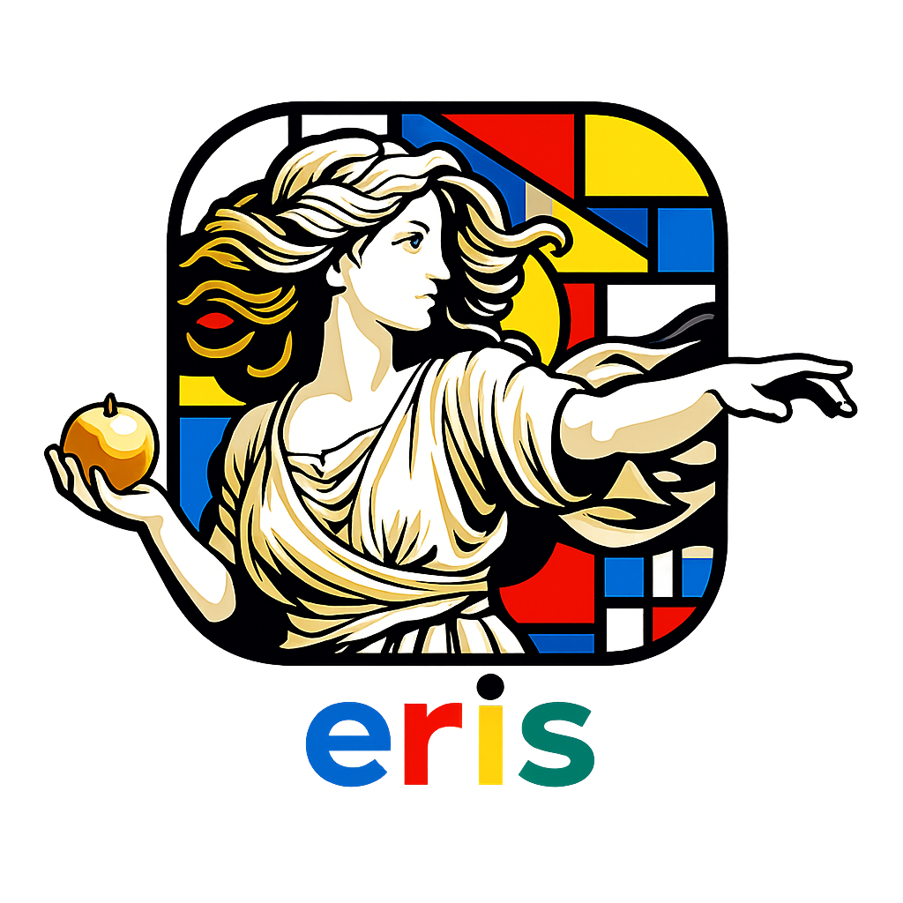
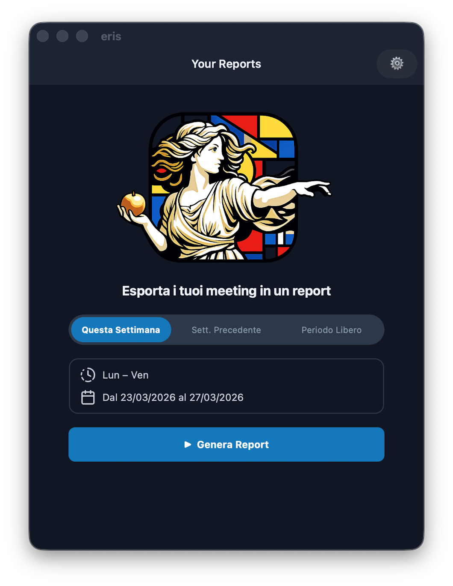
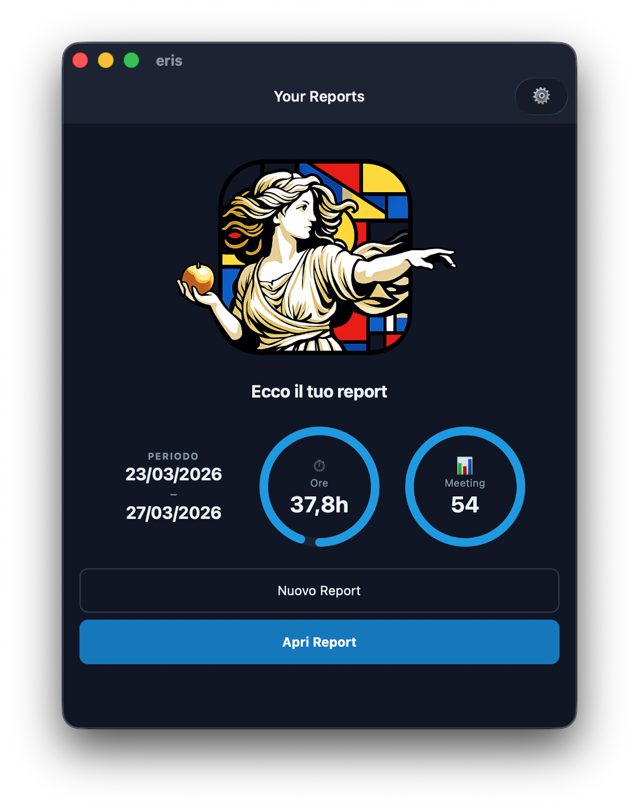
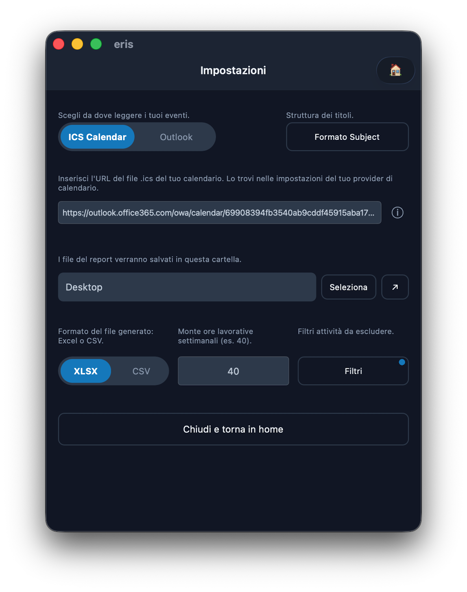

<p align="center">
  
</p>

<h3 align="center">Weekly calendar report generator</h3>

<p align="center">
  <strong>.NET 10</strong> · <strong>macOS</strong> · <strong>Windows</strong> · CLI + GUI
</p>

<p align="center">
  
  
  
</p>

---

**eris** è un'applicazione .NET 10 multipiattaforma (Windows / macOS) per esportare i meeting del calendario in report settimanali o mensili. Supporta due sorgenti dati:

- **Microsoft Graph** — autenticazione interattiva (MSAL), legge direttamente da Outlook / Microsoft 365
- **ICS** — scarica un file `.ics` da URL (es. Google Calendar, iCal, ecc.)

L'output può essere **CSV** o **XLSX** (con fogli _Detail_ e _Summary_).

---

## Funzionalità

La GUI MAUI offre due tab principali:

### Tab Home

- **Selezione periodo** — Slider a tre stati: _Questa settimana_, _Mese precedente_, _Periodo libero_
- **Lun–Ven / Lun–Dom** — Toggle per limitare il range ai soli giorni lavorativi (icona clock con indicatore visivo)
- **Selezione date** — Icona calendario cliccabile per scegliere date custom (attiva solo in periodo libero)
- **Grafici circolari** — Ore totali e numero meeting con arco di progresso rispetto al monte ore settimanale
- **Apertura rapida** — Link per aprire direttamente i file generati (Detail / Summary)

### Tab Impostazioni

- **Sorgente calendario** — ICS Calendar / Outlook (slider)
- **Formato Subject** — Template configurabile per il parsing dei titoli eventi
- **URL ICS** — Campo per inserire l'URL del file `.ics` (con guida integrata)
- **Account Microsoft** — Login/logout con stato di autenticazione (pallino + nome utente)
- **Cartella di output** — Selezione della cartella dove salvare i report
- **Formato export** — Slider CSV / XLSX
- **Ore settimanali** — Monte ore lavorative settimanali di riferimento
- **Filtri** — Dialog per escludere categorie, clienti, progetti, topic ed eventi provvisori

### Screenshot

<p align="center">
  
  
  
</p>

---


## Struttura della soluzione

```
eris/
├── eris.sln
├── Core/               — Logica condivisa (modelli, servizi, export)
├── Core.Tests/         — Test unitari (xUnit)
├── CLI/                — Interfaccia da terminale (System.CommandLine + Spectre.Console)
└── UI/                 — App MAUI dark-theme (Windows 10/11 + macOS Catalyst)
```

| Progetto | Descrizione |
|----------|-------------|
| **Core** | Modelli (`CalendarEvent`, `WeekRange`, `CategorySummary`, `EventFilters`, `AppConfig`), orchestratore report, servizi calendario (Graph + ICS), export CSV/XLSX |
| **CLI**  | Comandi: `generate`, `whoami`, `test-login`, `signout` |
| **UI**   | App MAUI con tema scuro, selezione periodo (settimana / mese / custom), grafico circolare, filtri eventi, template subject configurabile, esportazione one-click |
| **Core.Tests** | Test unitari (xUnit) per orchestratore e filtri |

---

## Avvio rapido

### Prerequisiti

- [.NET 10 SDK](https://dotnet.microsoft.com/download/dotnet/10)
- Per la UI MAUI: `dotnet workload install maui`
- Account Microsoft con Outlook Calendar attivo (oppure un URL ICS)

### CLI

```bash
cd eris/CLI

# Genera report per la settimana corrente (XLSX di default)
dotnet run -- generate --week this

# Settimana scorsa, in CSV, nella cartella specificata
dotnet run -- generate --week last --format csv --output ~/Report

# Sorgente ICS anziché Graph
dotnet run -- generate --week this --source ics --ics-url "https://example.com/cal.ics"

# Info account
dotnet run -- whoami

# Test login
dotnet run -- test-login

# Logout
dotnet run -- signout
```

### UI MAUI (macOS)

```bash
cd eris/UI
dotnet run -f net10.0-maccatalyst
```

### UI MAUI (Windows)

```powershell
cd eris\UI
dotnet run -f net10.0-windows10.0.19041.0
```

---

## Autenticazione

Per usare Microsoft Graph con eris devi configurare una **App Registration dedicata** in Microsoft Entra ID.

- Account supportati: personali Outlook + aziendali/scolastici M365
- Flusso: MSAL interactive login (browser) + silent token cache
- Permessi minimi: `Calendars.Read`, `User.Read`
- Redirect URI richiesto: `http://localhost` (Mobile and desktop applications)

### Flusso

1. Prima apertura → si apre il browser con la pagina di login Microsoft
2. Accetta i permessi `Calendars.Read` e `User.Read`
3. Il token viene salvato localmente (MSAL token cache) — i login successivi sono silenziosi

Guida completa setup Azure Entra ID: [docs/azure-entra-setup.md](docs/azure-entra-setup.md)

### Onboarding rapido

1. Copia il template CLI da [eris/CLI/appsettings.template.json](eris/CLI/appsettings.template.json) in `eris/CLI/appsettings.json`.
2. Inserisci il tuo `AzureAd:ClientId` (App Registration dedicata).
3. Lascia `TenantId` su `common` se vuoi supportare account personali + aziendali.
4. (Opzionale) prepara anche la configurazione UI partendo da [eris/UI/appsettings.template.json](eris/UI/appsettings.template.json).

Per i dettagli completi dei passaggi Azure, usa [docs/azure-entra-setup.md](docs/azure-entra-setup.md).

### Override configurazione

```jsonc
// CLI/appsettings.json  oppure  UI/appsettings.json
{
  "AzureAd": {
    "ClientId": "IL-TUO-CLIENT-ID",
    "TenantId": "common"
  }
}
```

Oppure tramite variabili d'ambiente:

```bash
export ERIS_AzureAd__ClientId="xxxx"
export ERIS_AzureAd__TenantId="common"
```

---

## Output generato

### Formato XLSX (default)

```
<cartella scelta>/
└── week-12-2026-report/
    └── week-12-2026-report_20260320-143500.xlsx   (fogli: Summary + Detail)
```

### Formato CSV

```
<cartella scelta>/
└── week-12-2026-report/
    ├── detail.csv     — Elenco dettagliato eventi (categoria; nome; ore)
    └── summary.csv    — Riepilogo per categoria con % sul totale
```

I file CSV usano `;` come separatore e UTF-8 con BOM (compatibili con Excel italiano).

### Subject strutturato

Per ottenere la suddivisione per Client / Progetto / Attività, nomina gli eventi con un formato a campi separati.

Il template di default è:

```
{Cliente} | {Progetto} | {Topic}
```

Esempio: `Acme | Platform | Code Review`

Il template è **configurabile** dalla UI (tab Impostazioni → "Formato Subject") o passando un template custom. I nomi dei campi e il separatore vengono dedotti automaticamente dal template (es. `{Client} - {Project} - {Task}` usa `-` come separatore).

---

## Filtri ed esclusioni

L'app permette di escludere eventi dal report in base a diversi criteri:

| Filtro | Descrizione |
|--------|-------------|
| **Categorie** | Escludi per categoria/tag (es. "Personale, OOO") |
| **Clienti** | Escludi per nome cliente |
| **Progetti** | Escludi per nome progetto |
| **Topic** | Escludi per argomento |
| **Eventi "tentative"** | Escludi eventi accettati come provvisori (abilitato di default) |

I filtri sono configurabili sia dalla CLI (`--exclude-categories`, ecc.) sia dalla UI (pulsante "Filtri" nel tab Genera).

---

## Monte ore settimanale

Le percentuali nella tabella Summary sono calcolate **rispetto al monte ore settimanale** configurato (default: 40h), non rispetto alla somma delle ore tracciate.

Esempio: con 20h di meeting su 40h settimanali, una categoria con 10h mostrerà `25.0%` (10/40).

Il monte ore è riportato in testa al foglio Summary sia in CSV che in XLSX.

---

## Sorgenti calendario

| Sorgente | Descrizione | Configurazione |
|----------|-------------|----------------|
| **Graph** | Microsoft Graph API — legge da Outlook / M365 | Login interattivo (MSAL) |
| **ICS** | Scarica un file `.ics` da URL | `--ics-url` nella CLI, campo URL nella UI |

La sorgente di default è configurabile in `appsettings.json` tramite `SourceType` (`Graph` o `Ics`).

---

## CI/CD

Il workflow GitHub Actions ([release.yml](.github/workflows/release.yml)) produce:

| Piattaforma | Artefatto | Trigger |
|-------------|-----------|---------|
| macOS (Catalyst) | `eris-macos.dmg` | Tag `v*.*.*` o dispatch manuale |
| Windows (unpackaged) | `eris-windows.zip` | Tag `v*.*.*` o dispatch manuale |

Su tag `v*.*.*` viene creata automaticamente una **GitHub Release** con entrambi gli artefatti allegati.

---

## Dipendenze principali

| Progetto | Pacchetto | Versione |
|----------|-----------|----------|
| Core | `Microsoft.Graph` | 5.56.0 |
| Core | `Microsoft.Identity.Client` | 4.61.3 |
| Core | `CsvHelper` | 33.0.1 |
| Core | `ClosedXML` | 0.104.2 |
| Core | `Ical.Net` | 4.3.1 |
| CLI  | `System.CommandLine` | 2.0-beta4 |
| CLI  | `Spectre.Console` | 0.49.1 |
| UI   | `Microsoft.Maui.Controls` | 10.0.0 |
| UI   | `CommunityToolkit.Maui` | 9.0.3 |
| UI   | `CommunityToolkit.Mvvm` | 8.3.2 |

---

## ❓ FAQ

**Q: Funziona con account aziendale M365?**  
A: Sì. Se il tenant ha policy restrittive, l'admin IT può fare un *admin consent* oppure registrare una propria App e inserire il ClientId in `appsettings.json`.

**Q: I miei dati vengono inviati a server esterni?**  
A: No. L'app chiama solo `graph.microsoft.com` (Microsoft) o l'URL ICS configurato. I report vengono scritti solo in locale.

**Q: Come gestisce gli eventi ricorrenti?**  
A: Con Graph usa `calendarView` che espande automaticamente le occorrenze. Con ICS espande le regole RRULE tramite `Ical.Net`. In entrambi i casi, ogni istanza appare come evento singolo.

**Q: Posso usare Google Calendar?**  
A: Sì, tramite la sorgente ICS. Basta copiare l'URL ICS del proprio calendario Google e usarlo con `--source ics --ics-url "URL"` nella CLI oppure selezionare ICS nella UI.

**Q: Qual è la differenza tra CSV e XLSX?**  
A: Il formato XLSX (default) genera un singolo file con due fogli (_Summary_ e _Detail_) formattati. Il CSV genera due file separati con separatore `;`.
